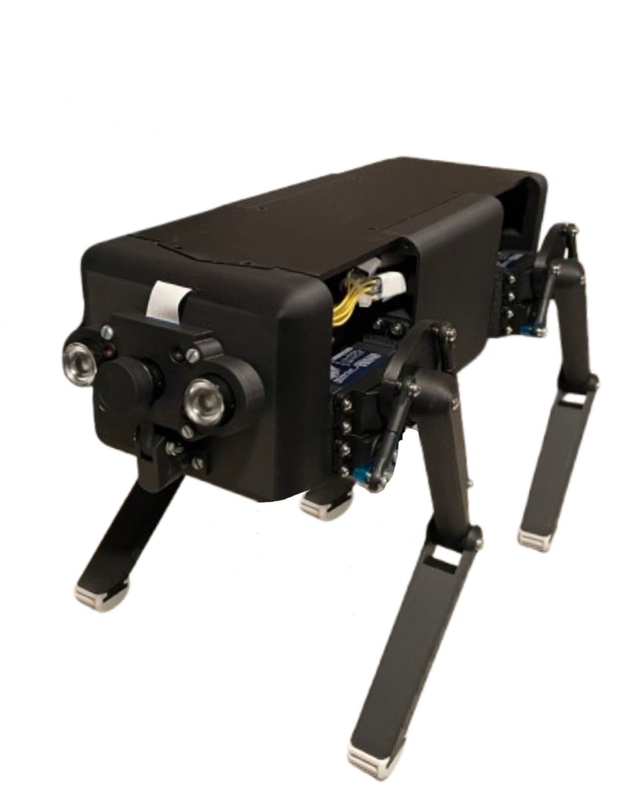

# **Debbie**
> 🚧 **_Project in Progress!_** – Regular updates are being made.

  

## **Description**
_Debbie_ is a straightforward yet fascinating quadrupedal robot designed with simplicity in mind. Stay tuned for ongoing enhancements! 
💰Project sponsored by _The Schrack Technik Group_

## Check out
### ⚙ Hardware-Development & Design:
- [Cesario Kufner](https://github.com/ckfnr)
- [Louati Momen](https://github.com/louatimomen)
### 💻 Programming:
- [AJ](https://github.com/AJ-Holzer)
### Huge Shoutout to [Mr. Hühnchen](https://github.com/MrHuehnchen)! 🎉
A massive thank you to __Mr. Hühnchen__ for calculating __all the computations__ for Debbie! 
💡⚡

<!--
## 📦 Installation
1. To install the whole project on your Raspberry Pi, just run `git clone https://github.com/ckfnr/Projekt-Debbie`.
2. Run the _main.py_ file
3. Let the magic work
-->
