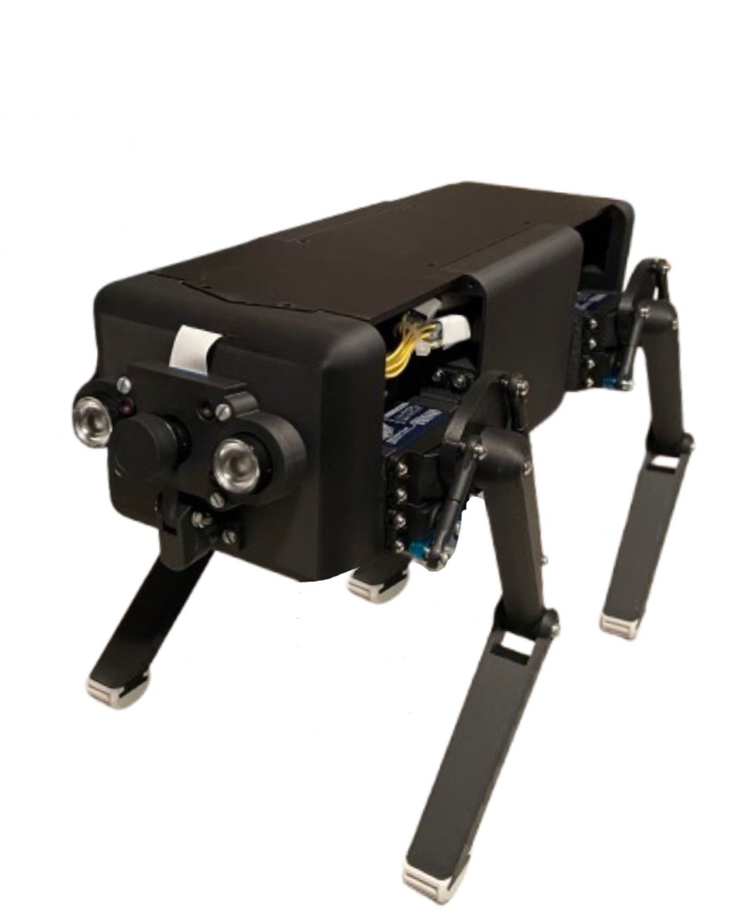

# **Debbie**

  

## 📜 **Description**
_Debbie_ is a straightforward yet fascinating quadrupedal robot designed with simplicity in mind. Stay tuned for ongoing enhancements! 
💰Project sponsored by _The Schrack Technik Group_

## 📝 Incoming
- Detailed documentation
- Remote control

## ⚙️ Accessories
- [Remote Control](https://github.com/AJ-Holzer/Debbie-V1---Keyboard)

## 👀 Check out
### ⚙ Hardware-Development & Design:
- [Cesario Kufner](https://github.com/ckfnr)
### 💻 Programming:
- [AJ-Holzer](https://github.com/AJ-Holzer)
### Documentation:
- [Louati Momen](https://github.com/louatimomen)
### Huge Shoutout to [Mr. Hühnchen](https://github.com/MrHuehnchen)! 🎉
A massive thank you to __Mr. Hühnchen__ for calculating __all the computations__ for Debbie! 
💡⚡

## Other Downloads
You can either download the source code _here on Github_ or from [AJServers](https://downloads.ajservers.site) 
_Path:_ `Debbie-V1`
